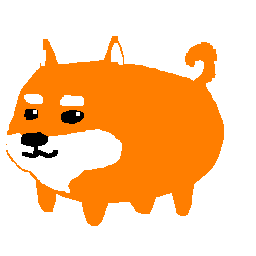
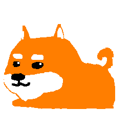
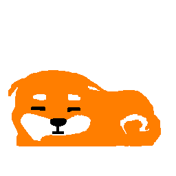

# SHIKA (CS50 Final Project)
#### Video Demo: https://youtu.be/DUgePg9MTV8

## Description
This is my final project for CS50, written in Javascript. It is a simple web game where that you can interact with Shika the Shiba.
 
[>Link to my Github hosting this game<](https://chewychair.github.io/game/shiba/index.html)
 
 

### Features:
Throw the ball: Shika will chase the ball and return it to you! (Unless he's asleep)

Otherwise Shika will chase you, and on reaching you he will start idling. If you move away, he will continue chasing. If you remain still, he will lie down for pets.

If you pet him, he will eventually fall asleep. You can pet him to wake him up.
If you don't pet him, he will start to wander around the screen. In this state, you can pet him and he will start chasing you again, or you can throw the ball and he will chase it.

You can also pet Shika repeatedly and he will lie down.
 
 

### Design Choices
I chose JavaScript so I could easily host this on a website. Also, it's mobile friendly!

Whether the ball is thrown or not is determined on the velocity of the pointer on release. The z-velocity of the ball is also determined based on release velocity, and the ball has both friction and gravity to give it the illusion of flying in a nice arc. Ball also bounces off the screen edges so it never goes out of bounds, although its z-axis may give it the illusion of being so.

Ball and Shika have a fake z-axis to give the illusion that they're bouncing/jumping respectively. If you throw the ball really fast along the x-axis, Shika will wait for it at the bottom!

Lots of timers and counters were used to make Shika transition between his states, as well as a function that checks distance from the pointer.

The line `this.ball = null` causes Shika to release the ball and it falls because of its own gravity. I thought that this was pretty cute.

Added the wandering behaviour to make Shika more organic. This way, if you are idle, he will walk to you, idle, lie down, then start wandering when you do not interact with him.

Usage of `pointerdown`, `pointerup`, `pointermove`, `pointerout` instead of `mousedown` or `touchdown` and their associated events: To make the game mobile friendly.

Shika, the ball and grass also render in order based on their y position. Fun fact: When the ball is in Shika's mouth, it's actually elevated on its z-axis, thus rendering in front of him. :exclamation: ~~There is a bug associated with this, documented below.~~

Grass is animated, and both grass and dirt patches are spawned randomly to give a more organic feel to the game.
 
 

### Bugs
~~There are some graphical glitches with the grass and ball. When Shika passes them on the y-axis when moving downward, they will briefly flicker. It is probably due to the clumsy way that I implemented the rendering of these objects. However, the game is already cute enough and the flickering is not very noticeable so I'll leave it at that. :)~~ This was caused by me stupidly updating and rendering Shika in the same function, instead of updating everything and rendering after. Oops.

If you happen to be on the same x position as the ball when Shika picks it up he will run to you with the ball in the center of his body. This is a pretty easy fix but it looks really funny so I left it in.

### Files
`index.html` html file to run this JavaScript  
`index.js` JavaScript file that does pretty much everything

### Credits:
[Pixilart](https://www.pixilart.com) for sprites
 
[jsfxr](https://sfxr.me/) for sounds 

 

### FAQ:
**Q:** Is Shika a typo?

**A** No, he's named after Shikamaro, the similarly orange and white mascot of Nara. [See here.](https://narashikanko.or.jp/en/feature/deer/) Also I like Yorushika.

